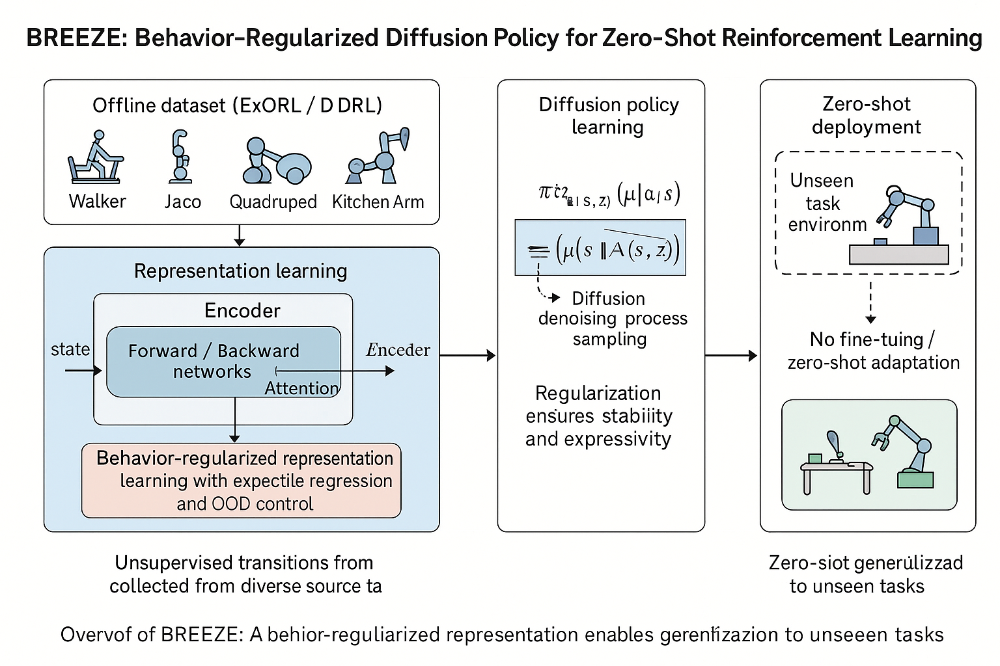

<div align="center">
  <!-- TODO: Update the image path with the final figure from the paper -->
  <h1>Robust Zero-Shot Reinforcement Learning (BREEZE)</h1>
  <p><em>Behavior-regularized zero-shot RL with expressivity enhancement (NeurIPS 2025)</em></p>
  <p>
    <a href="https://arxiv.org/abs/XXXX.YYYYY">📄 Paper (preprint)</a> ·
    <a href="https://YOUR_PROJECT_PAGE">🌐 Project page</a> ·
    <a href="https://doi.org/XX.XXXX/XXXXX">🔗 DOI</a>
  </p>
</div>



## Table of Contents
- [Highlights](#highlights)
- [Repository Structure](#repository-structure)
- [Environment Setup](#environment-setup)
- [Data Preparation](#data-preparation)
- [Running Experiments](#running-experiments)
- [Connection to Weights & Biases](#connection-to-weights--biases)
- [Reproducing the Paper](#reproducing-the-paper)
- [Logging and Checkpoints](#logging-and-checkpoints)
- [Troubleshooting](#troubleshooting)
- [Results Snapshot](#results-snapshot)
- [Citation](#citation)
- [License](#license)
- [Acknowledgements](#acknowledgements)

## Highlights
- **BREEZE** combines behavior regularization with expressive latent dynamics to enable robust zero-shot transfer from offline data.
- Provides reference implementations for BREEZE and strong baselines (FB, C(F)B, SF, CQL, SAC, TD3).
- Built on top of DM Control with custom task suites and reward constructors for evaluating zero-shot generalization.
- Supports experiment tracking with Weights & Biases and reproducible configurations via YAML files per algorithm.

## Repository Structure
```
BREEZE/
├── agents/                 # Algorithm implementations and configs (breeze, fb, cfb, cql, etc.)
│   ├── <algo>/
│   │   ├── agent.py        # Core training logic for the algorithm
│   │   ├── config.yaml     # Default hyperparameters used in the paper (edit to replicate ablations)
│   │   └── saved_models/   # Default checkpoint directory
│   ├── base.py             # Common replay buffer utilities
│   ├── utils.py            # Agent-side helpers (networks, losses, schedules)
│   └── workspaces.py       # Workspace classes orchestrating training loops
├── custom_dmc_tasks/       # Extensions to DM Control domains (jaco, point_mass_maze, quadruped, walker)
│   └── common/             # Shared wrappers and utilities for custom tasks
├── rewards/                # Reward shaping functions for evaluation tasks
├── main_offline.py         # Entry point for offline zero-shot RL training and evaluation
├── exorl_reformatter.py    # Script to download and reshape ExORL datasets into a single NPZ
├── download.sh             # Convenience downloader for ExORL buffers
├── dmc.py                  # Environment wrappers adapted from the ExORL benchmark
├── utils.py                # Global helpers (e.g., reproducibility utilities)
├── requirements.txt        # Python dependencies (DM Control, Torch, hydra, tqdm, etc.)
├── LICENSE                 # MIT license
└── README.md               # You are here – high-level documentation
```

## Environment Setup
We recommend using Conda (or Miniconda) to isolate dependencies. The paper experiments used Python 3.8.

```bash
conda create -n breeze python=3.8
conda activate breeze
pip install -r requirements.txt
```

<details>
<summary>Alternative: Virtualenv</summary>

```bash
python3 -m venv .venv
source .venv/bin/activate
pip install --upgrade pip
pip install -r requirements.txt
```
</details>

### Additional Dependencies
- The DM Control suite requires [Mujoco](https://mujoco.org/) and appropriate GLFW bindings. Ensure Mujoco is installed and `MUJOCO_GL=egl` (or `osmesa`) is set if running headless.
- Weights & Biases logging is enabled by default; set `WANDB_API_KEY` before launching experiments or pass `--wandb_logging False`.

## Data Preparation
All experiments rely on offline datasets released with ExORL. This repository includes scripts to download and reformat those datasets.

1. **Download the raw buffers:**
   ```bash
   bash download.sh walker proto          # DOMAIN ALGO (proto, rnd, medium, ...)
   bash download.sh walker rnd
   ```
2. **Reformat to a single NPZ file:**
   ```bash
   python3 exorl_reformatter.py walker_proto
   python3 exorl_reformatter.py walker_rnd
   ```
   The script consolidates individual episode files into `datasets/<domain>/<algo>/dataset.npz` and removes the original shards.
3. **Point the trainer to the dataset:** `main_offline.py` currently expects datasets under `/data/zeroshot_dataset/datasets/<domain>/<algo>/dataset.npz`. Choose one of the following:
   - Create a symlink to match the expected path (requires write access):
     ```bash
     mkdir -p /data/zeroshot_dataset
     ln -s $(pwd)/datasets /data/zeroshot_dataset/datasets
     ```
   - OR edit the `dataset_path` in `main_offline.py` to your local path. 
   - OR export an environment variable and modify the script to consume it (placeholder: `export DATASET_ROOT=/path/to/datasets`).

> **TODO:** Update this section with the final dataset hosting location and any curated splits released with the paper (e.g., BREEZE-specific buffers).

## Running Experiments
The main entry point is `main_offline.py`, which takes the algorithm name, domain, and exploration policy that generated the dataset. Key flags:

```
usage: main_offline.py <algorithm> <domain_name> <exploration_algorithm> \
                       --eval_tasks TASK [TASK ...] [--train_task TASK]
                       [--seed INT] [--learning_steps INT]
                       [--z_inference_steps INT] [--run_name STR]
                       [--model_name STR] [--wandb_logging {True,False}]
                       [--lagrange {True,False}] [...]
```

- `algorithm`: one of `breeze`, `fb`, `cfb`, `vcfb`, `mcfb`, `cql`, `sac`, `td3`, `sf-lap`, `sf-hilp`.
- `domain_name`: DM Control domain (`walker`, `quadruped`, `jaco`, `point_mass_maze`, ...).
- `exploration_algorithm`: dataset source tag (`proto`, `rnd`, `medium`, etc.).
- `--eval_tasks`: list of downstream tasks for zero-shot evaluation.
- `--train_task`: optional, use when the dataset contains multiple behaviors.

### Examples
```bash
# BREEZE on Walker with RND exploration data
python3 main_offline.py breeze walker rnd \
  --eval_tasks stand run walk flip \
  --seed 1 --learning_steps 1000000 --run_name breeze-walker-rnd-seed1

# Forward-Backward baseline (FB) on the same dataset without W&B logging
python3 main_offline.py fb walker rnd \
  --eval_tasks stand run walk flip \
  --seed 1 --wandb_logging False

# Conservative Q-Learning baseline on Quadruped
python3 main_offline.py cql quadruped medium_expert \
  --eval_tasks walk run \
  --seed 7 --learning_steps 500000
```

Configuration defaults (network sizes, optimizers, diffusion settings, etc.) are stored in `agents/<algo>/config.yaml`. Override any value via CLI flags or by editing the YAML.

## Connection to Weights & Biases
BREEZE integrates experiment tracking with [Weights & Biases](https://wandb.ai) out of the box. When `--wandb_logging` is left at its default (`True`), the offline workspace opens a run with the merged CLI/YAML configuration and logs every training and evaluation metric [agents/workspaces.py:248].

### Authenticate & configure
1. `export WANDB_API_KEY=YOUR_KEY` (or run `wandb login`) before launching `main_offline.py`.
2. Optionally export `WANDB_ENTITY`, `WANDB_PROJECT`, or `WANDB_NAME` to override the defaults from `agents/<algo>/config.yaml` (`project`, `name`) without editing the file (see `agents/breeze/config.yaml:2` and `agents/breeze/config.yaml:4`).
3. For air-gapped runs, set `WANDB_MODE=offline` (or `dryrun`) so logs are stored locally in `wandb/` and can be synced later with `wandb sync`.

### Run metadata
- Each algorithm YAML defines a canonical `name` and `project` that become the W&B run display name and project when logging is on. Edit those fields (or use the env overrides above) to keep paper experiments organized.
- Runs are tagged automatically with the agent identifier (`agent.name`) for quick filtering in the W&B UI [agents/workspaces.py:253]. Add more tags via `wandb` environment variables if needed.
- Setting `save: true` in the config causes the best checkpoint discovered during training to be uploaded as a W&B artifact at the end of the run [agents/workspaces.py:256]. If network access is unavailable, leave this flag `false` or rely on the local copies under `agents/<algo>/saved_models`.
- Toggle logging off per run with `--wandb_logging False`; metrics then stay on disk via the custom loggers [agents/base.py:455].

## Reproducing the Paper
> This section will be fully populated after camera-ready submission. Placeholder commands below capture the protocol used during development.

1. **Set seeds:** The paper reports averages over `seed ∈ {1, 2, 3, 4, 5}`.
2. **Train BREEZE:**
   ```bash
   for seed in 1 2 3 4 5; do
     python3 main_offline.py breeze walker rnd \
       --eval_tasks stand run walk flip \
       --seed ${seed} --learning_steps 1000000 \
       --run_name breeze-walker-rnd-seed${seed} \
       --model_name walker-breeze-rnd
   done
   ```
3. **Train baselines:** Replace `breeze` with `fb`, `vcfb`, `cql`, etc., keeping the same seeds and evaluation tasks for a fair comparison.
4. **Aggregate metrics:** Metrics are logged to W&B under the project specified in `agents/<algo>/config.yaml` (default: `breeze-final`). Export results using the W&B UI or `wandb sync`. For an offline workflow, extend `OfflineRLWorkspace.evaluate()` to dump CSV summaries (placeholder).
5. **Evaluation-only runs:** To load checkpoints from `agents/<algo>/saved_models`, set `--model_name` to the directory name and use a script snippet (TODO: publish helper).

| Experiment | Dataset | Seeds | Command template |
| --- | --- | --- | --- |
| Walker Zero-Shot | walker / rnd | 5 | `python3 main_offline.py breeze walker rnd --eval_tasks stand run walk flip --seed {seed}` |
| Quadruped Transfer | quadruped / medium_expert | 5 | `python3 main_offline.py breeze quadruped medium_expert --eval_tasks walk run --seed {seed}` |
| Jaco Manipulation | jaco / ??? | 3 | `python3 main_offline.py breeze jaco <exploration_algo> --eval_tasks reach push --seed {seed}` |

> **TODO:** Fill in the final datasets, tasks, and hyperparameters once the paper artifacts are frozen.

## Logging and Checkpoints
- **Checkpoints:** Saved under `agents/<algo>/saved_models/<timestamp>/`. Supply `--model_name` to override the directory name.
- **W&B logging:** Enabled when `--wandb_logging True`. Set `WANDB_API_KEY` and optionally `WANDB_PROJECT` / `WANDB_ENTITY`.
- **Tensorboard:** Not enabled by default. If needed, wrap evaluations in `agents/workspaces.py` with Tensorboard writers.
- **Artifacts:** Consider using `wandb artifact put` (placeholder) to share trained policies; update this README when available.

## Troubleshooting
- **Missing datasets:** Ensure the dataset path matches the expectation in `main_offline.py`. Symlinks are often easier than editing the code for quick tests.
- **Mujoco headless crashes:** Export `MUJOCO_GL=egl` (or `osmesa`) before running.
- **CUDA availability:** The training script automatically falls back to MPS (Apple Silicon) or CPU if CUDA is unavailable. Double-check PyTorch was installed with the desired accelerator support.
- **Unexpected config fields:** All CLI arguments are merged into the YAML config. Mistyped flags will surface as YAML keys—verify with `print(config)` inside `main_offline.py` if behaviour differs from expectation.

## Results Snapshot
> Placeholder table – replace with the final numbers from the paper once finalized.

| Domain / Task | BREEZE (ours) | Best baseline | Notes |
| --- | --- | --- | --- |
| Walker / Stand | **XX ± YY** | ZZ ± WW (FB) | RND dataset |
| Walker / Run | **XX ± YY** | ZZ ± WW (CQL) | RND dataset |
| Quadruped / Walk | **XX ± YY** | ZZ ± WW (VCFB) | Medium-Expert dataset |

Include qualitative figures from the paper (e.g., learning curves, success rate histograms) in `docs/media/` and embed them here.

## Citation
If you find this repository helpful, please cite:

```bibtex
@inproceedings{zheng2025towards,
  title={Towards Robust Zero-Shot Reinforcement Learning},
  author={Kexin Zheng and Lauriane Teyssier and Yinan Zheng and Yu Luo and Xianyuan Zhan},
  booktitle={NeurIPS},
  year={2025}
}
```

## License
This project is licensed under the MIT License. See `LICENSE` for the full text.

## Acknowledgements
- Based on the [Zero-Shot Reinforcement Learning from Low Quality Data](https://enjeeneer.io/projects/zero-shot-rl/) codebase, extended with behavior-regularized expressivity enhancements.
- Thanks to the ExORL authors for releasing datasets and baselines that made this work possible.

## Contact
For questions, please open an issue or reach out to `<contact@yourdomain>` (replace with the official contact email).

