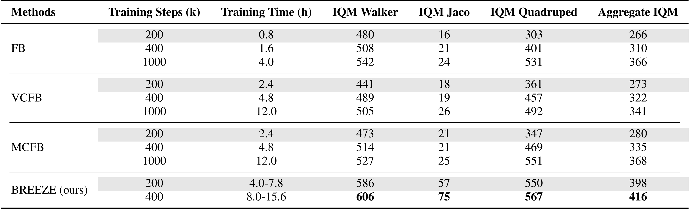

# Behavior-regularized zero-shot RL with Expressivity Enhancement (BREEZE)</h1>
## Towards Robust Zero-shot Reinforcement Learning (NeurIPS 2025)
<a href="https://github.com/Whiterrrrr/BREEZE/blob/main/LICENSE"></a>
<a href="https://github.com/psf/black"></a>
<a href="https://arwen-c.github.io/breeze/"></a>
 [](https://arxiv.org/abs/2510.15382)
  

The is the official codebase for [Towards Robust Reinforcement Learning](https://arxiv.org/abs/2510.15382) from [Kexin Zheng](https://air-dream.netlify.app/author/kexin-zheng/)\*, [Lauriane Teyssier](https://arwen-c.github.io/)\*, [Yinan Zheng](https://github.com/ZhengYinan-AIR), Yu Luo, [Xianyuan Zhan](https://zhanzxy5.github.io/zhanxianyuan/)\
*Equal contribution


### Content
- [Overview](#overview)
- [Setup](#setup)
- [Running Experiments](#running-experiments)
- [Acknowledgements](#acknowledgements)

## Overview
**BREEZE** is an FB-based framework that simultaneously enhances learning stability, policy extraction capability, and representation learning quality, through **three key designs**:

- **Behavioral regularization** in zero-shot RL policy learning, transforming policy optimization into a stable in-sample learning paradigm.
- **Task-conditioned diffusion model policy extraction**, enabling the generation of high-quality and multimodal action distributions in zero-shot RL settings.
- **Attention-based architectures** for representation modeling to capture the complex relationships between environmental dynamics.

### Performance
BREEZE achieves the best or near-best returns with faster convergence and enhanced stability. 
<div align="center">

</div>
BREEZE within 400k steps can match or exceed baselines trained for 1M steps.
<div align="center">

</div>

## Setup
### Requirements
* Python 3.10
* [Mujoco](https://mujoco.org/) - required by the DM Control suite. Note: While our experiments used separate MuJoCo binaries, the latest mujoco pip package now includes them.
* [Wandb](https://wandb.ai/site/) - for experiment tracking. Set `WANDB_API_KEY` before launching experiments or pass `--wandb_logging False`.

Install dependencies
```bash
conda create -n breeze python=3.10
conda activate breeze
pip install -r requirements.txt
```

### Data Preparation
All experiments rely on offline datasets from [ExORL](https://github.com/denisyarats/exorl/tree/main).
Our repository includes a script to automatically download and reformat the datasets for the tasks and algorithms below.

**ExORL Download & Reformat**
```bash
bash data_prepare.sh
```

**Domains and Tasks**

| **Domain** | **Eval Tasks**                                                              | **Dimensionality** | **Type**      | **Reward** | **Command Line Argument** |
|--------------|-----------------------------------------------------------------------------|--------------------|---------------|-----------|---------------------------|
| Walker | `stand` `walk` `run` `flip`                                                 | Low                | Locomotion         | Dense     | `walker`                  |
| Quadruped | `stand` `walk` `run` `jump`                                  | High               | Locomotion         | Dense     | `quadruped`               |
| Jaco | `reach_top_left` `reach_top_right` `reach_bottom_left` `reach_bottom_right` | High               | Goal-reaching      | Sparse    | `jaco`                     |

**Exploration Algorithms for Dataset Collection**

| **Exploration Algorithm**                                                                     | **Command Line Argument** |
|------------------------------------------------------------------------------------------------------|---------------------------|
 | [Random Network Distillation (RND)](https://arxiv.org/abs/1810.12894)                                | `rnd`                     |
 | [Diversity is All You Need (DIAYN)](https://arxiv.org/abs/1802.06070)                                | `diayn`                   |
 | [Active Pretraining with Successor Features (APS)](https://arxiv.org/abs/2108.13956)                 | `aps`                     |
 | [Reinforcement Learning with Prototypical Representations (PROTO)](https://arxiv.org/abs/2102.11271) | `proto`                   |


### Repository Structure
We provide the repository structure in [repository_structure.md](docs/repository_structure.md).

## Running Experiments
The main entry point is `main_offline.py`, which takes the algorithm name, domain, and exploration policy that generated the dataset. Key flags:

```
usage: main_offline.py <algorithm> <domain_name> <exploration_algorithm> \
                       --eval_tasks TASK [TASK ...] [--train_task TASK]
                       [--seed INT] [--learning_steps INT]
                       [--z_inference_steps INT]
                       [--wandb_logging {True,False}]
```

- `algorithm`: one of `breeze`, `fb`, `cfb`, `vcfb`, `mcfb`, `cql`, `sac`, `td3`, `sf-lap`, `sf-hilp`(see table below).
- `domain_name`: DMC domain (`walker`, `quadruped`, `jaco`, `point_mass_maze`, ...).
- `exploration_algorithm`: dataset source tag (`proto`, `rnd`, `aps`, etc.).
- `--eval_tasks`: list of downstream tasks for zero-shot evaluation.

**Example**
```bash
# BREEZE on Quadruped with RND exploration data
python main_offline.py breeze quadruped rnd \
  --eval_tasks stand run walk jump \
  --seed 42 --learning_steps 1000000
```

Configuration defaults (network sizes, optimizers, diffusion settings, etc.) are stored in `agents/<algo>/config.yaml`. Override any value via CLI flags or edit the YAML.

### Available algorithms

| **Algorithm**                                                    | **Authors**                                                | **Type**               | **Command Line Argument** |
|------------------------------------------------------------------|------------------------------------------------------------|------------------------|---------------------------|
| Breeze                                                           | [Zheng et al. (2025)]()                                    | Zero-shot RL           | `breeze`                  |
| FB Representations                                               | [Touati et al. (2023)](https://arxiv.org/abs/2209.14935)   | Zero-shot RL           | `fb`                      |
| Conservative FB Representations (VCFB/MCFB)                      | [Jeen et al. (2024)](https://arxiv.org/abs/2309.15178)     | Zero-shot RL           | `mcfb/vcfb`               |
| Conservative Q-learning                                          | [Kumar et al. (2020)](https://arxiv.org/abs/2006.04779)    | Single-task Offline RL | `cql`                     |
| Soft Actor-Critic (SAC)                                          | [Haarnoja et al. (2018)](https://arxiv.org/abs/1812.05905) | Online RL              | `sac`                     |
| Twin Delayed DDPG (TD3)                                          | [Fujimoto et al. (2018)](https://arxiv.org/abs/1802.09477) | Online RL              | `td3`                     |
| Successor Features with Laplacian Eigenfunctions (SF-LAP)        | [Borsa et al. (2018)](https://arxiv.org/abs/1812.07626)    | Zero-shot RL           | `sf-lap`                  |
| Successor Features with Hilbert foundation policy (SF-HILP)      | [Park et al. (2024)](https://arxiv.org/pdf/2402.15567)     | Zero-shot RL           | `sf-hilp`                 |

### Reproducing the Paper
We provide the domain-specific hyperparameters used in our experiments in [domain_specific_hyp.md](docs/domain_specific_hyp.md).

## Acknowledgements
We thank all the contributions of prior studies:
- This implementation is based on the [Zero-Shot Reinforcement Learning from Low Quality Data](https://enjeeneer.io/projects/zero-shot-rl/) codebase.

- The implementation of Diffusion model is based on [IDQL](https://arxiv.org/pdf/2304.10573)

## Citation
If you find this repository helpful, please consider citing our paper:

```bibtex
@inproceedings{zheng2025towards,
  title={Towards Robust Zero-Shot Reinforcement Learning},
  author={Kexin Zheng and Lauriane Teyssier and Yinan Zheng and Yu Luo and Xianyuan Zhan},
  booktitle={NeurIPS},
  year={2025}
}
```

## License
This project is licensed under the MIT License. See `LICENSE` for the full text.
